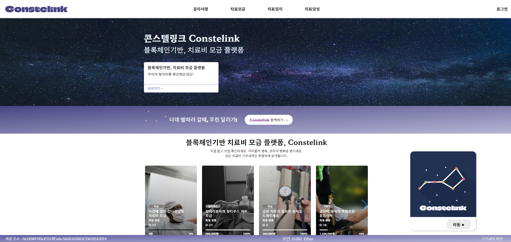

# Constelink

기간: 2023.02 ~ 2023.04
기술스택: Java, JavaScript, React.js, Redux, Solidity, Spring, TypeScript, web3.js
담당역할: Backend, Frontend
프로젝트 개요: 블록체인 기반 기부 서비스 제공 웹사이트

자체제작 코인을 이용하여 블록체인으로 기부 기록을 남기고 사용 기록을 남기는 웹사이트입니다. 계정은 병원 계정과 일반 계정 2종류가 있습니다. 병원 계정은 환자와 기부 정보를 등록하여 부족한 치료비를 기부받을 수 있고, 일반 계정은 유료결제를 통해  MetaMask 지갑을 이용하여 기부 기록을 블록체인에 남기며 기부할 수 있습니다.

✔️**구현 사항**

- web3, solidity,이더리움 테스트넷을 이용한 블록체인 기부 구현
- TypeScript를 이용한 디버깅에 강한 웹사이트 구현

✔️**담당 역할**

- JPA와 JQuery를 이용한 api 구축
- JWT 토큰 검증 서버 구현
- React와 TypeScript를 이용한 컴포넌트 UI 제작

✔️**기술 스택**

Java, Spring, JPA, Typescript, React.js, Redux, gRPC통신

✔️**기술 선정 이유**

1. TypeScript
    - 변수 타입을 미리 선언하고 사용하기 때문에 디버깅하기 더 쉬워서 유지 보수성이 좋아지기 때문에 타입 스크립트를 사용했습니다.
2. JPA
    - 영속성 컨텍스트에 올려 더티을 통해 변화를 체킹하여 기존 MyBatis보다 더 효율적이기 때문에 JPA를 사용했습니다.
    - 또한, JPA는 간단한 쿼리의 데이터를 찾을때 가독성도 훨씬 좋기 때문에 JPA를 사용했습니다.
3. gRPC
    - 일반 Http 통신(REST)를 서버간 통신에 이용하기에는 느리다고 생각해서 gRPC를 사용했습니다. 메시지 큐도 있었지만, 데이터 처리에 시간이 많이 걸리지 않기 때문에 gRPC를 사용했습니다.
    - 크로스 플랫폼을 통한 확장을 고려할 때도 gRPC를 사용하면 좋다고 생각했습니다. 서로 다른 언어도 호환되도록 만들었기 때문에 MSA 아키텍처에서 훨씬 유연하게 사용할 수 있을 것이라 판단했습니다.