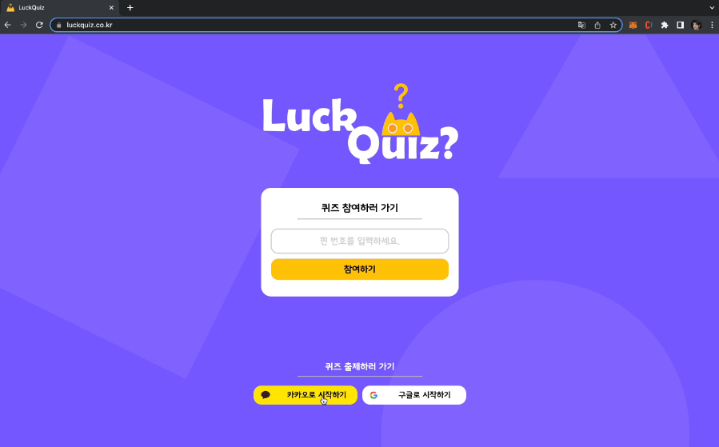

# LuckQuiz

기간: 2023.04 ~ 2023.05
기술스택: Java, Kafka, Spring, Stomp
담당역할: Backend api 구현
프로젝트 개요: kafka와 Stomp 프로토콜을 이용하여 만든 퀴즈 웹사이트

퀴즈 게임을 진행할 수 있도록 서비스를 제공하는 웹페이지 LuckQuiz입니다. 카카오와 구글로 로그인하여 퀴즈를 제작하고 퀴즈방을 만들 수 있습니다. 입장은 QR코드 혹은 Pin 번호를 입력하여 입장할 수 있습니다. 분위기 환기를 위한 풍선 터트리기, 달걀 깨기, 감정 인식 게임도 할 수 있습니다.

✔️**구현 사항**

- MSA 아키텍처에서 채점 서버 구현
- Websocket 기반 프로토콜인 Stomp를 이용한 api
- Kafka를 이용한 서버간 통신

✔️**담당 역할**

- 채점 및 랭킹 알고리즘 구현.
- Kafka Producer, Consumer 배치로 데이터 처리.
- Websocket(Stomp) 소켓 설정.

✔️**기술 스택**

Java, Spring, Kafka, Stomp

✔️**기술 선정 이유**

1. Stomp 프로토콜
    - 기본 Websocket 프로토콜보다는 기능이 많아서 느리지만, Session 관리를 pub/sub 구조로 하기 때문에 훨 씬 쉽습니다. LuckQuiz 웹사이트에서는 QuizRoom을 생성하고 관리하려면 Session 관리가 필수적 이기 때문에 세밀한 Session 관리가 필요합니다.
    - Socket.io라는 node.js 서버에서 사용할 수 있는 Websocket 기반 라이브러리도 있습니다. 이 라이브러리는 Session 관리를 더 쉽고 세밀하게 관리할 수 있지만, 속도가 Stomp 프로토콜보다 느리기도 하고, Kafka는 Java 라이브러리를 공식적으로 지원하기 때문에 Stomp 프로토콜을 사용하는게 더 유리했습니다.
    - Stomp 프로토콜은 Sockjs도 쉽게 적용할 수 있기 때문에 WebSocket이 기본 내장되어있지 않는 브라우저에서도 Http Polling을 이용하여 통신할 수 있게 할 수 있습니다.
2. Kafka
    - Quiz 플랫폼은 짧은 시간에 대용량 트래픽이 발생할 수 있습니다. 그렇기 때문에 Kafka를 이용하여 순간 들어오는 트래픽을 병렬 처리  했습니다.
    - Kafka를 메시지 큐로서 서버간 통신을 하는데 이용했습니다.
    - Kafka를 사용하면 데이터를 가공하거나 그대로 영구적으로 저장할 수 있고, TimeStamp를 기준으로 열람할 수 있기 때문에 제대로 실행되는지 모니터링 하기도 쉽습니다.