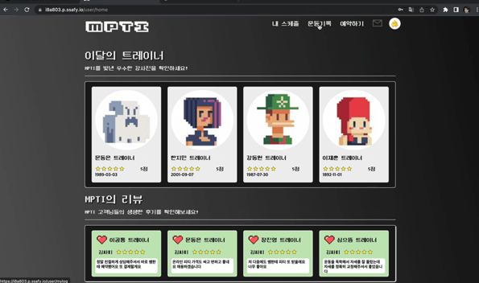

# MPTI

기간: 2023.01 ~ 2023.02
기술스택: JavaScript, React.js, WebRTC, WebSocket
담당역할: WebRTC, WebSocket통신 적용, 컴포넌트 UI 제작
프로젝트 개요: MPTI라는 화상채팅을 통한 PT서비스 제공 웹사이트

MPTI는 WebRTC를 이용한 화상채팅을 통해 온라인 PT 서비스를 제공할 수 있는 웹사이트 입니다. 트레이너에게 개인 상담도 가능하며, 상담 내역은 저장됩니다. 예약은 캘린더를 통해 관리가 가능하고 카카오페이를 통해 결제가 가능합니다. 개인 트레이닝을 받으면 리뷰를 할 수 있으며, 신고기능을 이용하면 관리자 계정에서 정지가 가능합니다. 트레이닝을 받으면 부위별로 어느정도 운동했는지 트레이너가 체크 가능하며, 운동 기록을 글로 남길 수 있습니다.

✔️**구현 사항**

- 온라인 화상 채팅 PT 서비스
- PT 예약 시스템
- 트레이너 이름/날짜별 검색 시스템
- 채팅 시스템

✔️**담당 역할**

- 컴포넌트 UI 작성
- WebRTC, WebSocket을 이용하여 채팅과 화상채팅 구현

✔️**기술 스택**

 ES6(JS), React, Redux, WebRTC, WebSocket

✔️**기술 선정 이유**

1. Redux
    - 상위 컴포넌트에서 사용하는 데이터를 사용할때, 반복적인 Props 사용을 줄여 코드의 복잡도가 줄고 유지 보수하기가 쉬워진다.
    - 상태별로 전역 관리할 수 있기 때문에 코드의 중복이 줄고, 가독성이 좋아지며 유지 보수성이 좋아집니다.
2. WebRTC
    - 온라인 화상 PT 서비스는 주로 소규모로 진행하기 때문에, 영상을 서버에서 중계하기 보다 클라이언트 간 통신을 통해 영상을 공유하는 것이 효율적입니다.
3. STOMP 프로토콜
    - 채팅은 상담 서비스를 위해 주로 사용되기 때문에, 기록을 남겨야할 필요성이 습니다. 그래서 WebRTC 보다는, WebSocket을 이용한 서버와의 통신으로 채팅 기록을 저장했습니다.
    - 기본 WebSocket을 사용하면 Session 관리가 힘듭니다. 그리고 백엔드의 경우 Spring을 사용하기 때문에 Stomp를 사용하여 소켓통신을 이용했습니다.