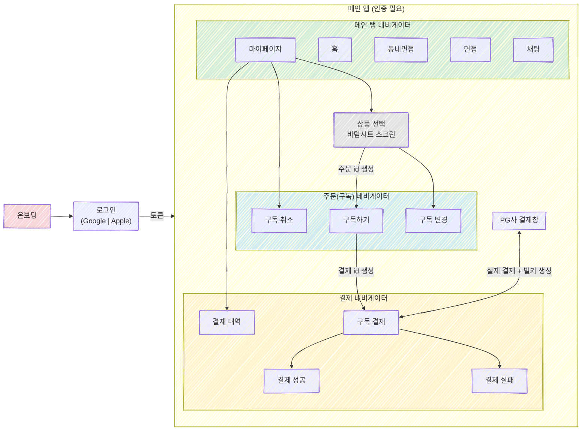

# 🧗 [Developer]  윤동근

- 이름          - 윤동근
- E-MAIL     - ehdrmsdl9999@naver.com
- Blog        - https://yooncarrot.com
- 자격증       - 정보처리 기사 | 화공 기사
 

## 진행중 프로젝트
<table>
  <tr>
  <th>프로젝트명</th>
    <th>간단 소개</th>
    <th>인원/역할</th>
    <th>기간</th>
    <th>참고 자료</th>
  </tr>
  <tr>
    <td>Mockly</td>
    <td>
      AI 면접 연습 서비스  
      Online 면접 메이트  
      오프라인 면접 메이트
    </td>
    <td>2명(FE 1, BE 1)/FE</td>
    <td>2025.11 ~ 진행중</td>
    <td><a href="https://github.com/Mockly-Company">GitHub</a> | <a href="https://69324aeddcbd1324310464e9-giibikyaod.chromatic.com/">디자인 시스템</a></td>
  </tr>
  <tr>
    <th colspan="5">
      Mockly 진행상황
    </th>
  </tr>
  <tr>
      <td>라이트 앱 UI</td>
      <td>다크 앱 UI</td>
      <td>모바일 스토리북</td>
      <td colspan="2">웹 스토리북</td>
  </tr>
  <tr>
    <td><image src="https://github.com/user-attachments/assets/5f3a634e-6d5f-4544-8bc6-b225bf8e3f30" style="width:300;"></image></td>
    <td><image src="https://github.com/user-attachments/assets/e9408cb8-872a-45e4-ba31-6883f859233a" style="width:300;"></image></td>
        <td><image src="https://github.com/user-attachments/assets/c11f1b8b-686e-435d-b64f-4a7a3818ee20" style="width:300;"></image></td>
        <td colspan="2"><image src="https://github.com/user-attachments/assets/0f9f4d8a-56dc-4727-b6d5-c7bf5bd3c12e" style="width:300;">
          <!--  -->
        </image></td>
  </tr>
</table>

## 비지니스 프로젝트
| 프로젝트명               | 간단 소개     | 역할        | 기간                |
| ------------------------ | ------------- | ----------- | ------------------ |
| CRM, e-commerce 시스템      | CRM,ERP,Commerce 시스템 구축 | 프론트엔드  | 2023.07 \~ 2024.12 |
| 농어촌 공사 민원 IMS            | Legacy 민원 시스템과 호환 가능한 민원 관리 시스템 구축 | 프론트엔드   | 2024.04 \~ 2024.12 |
| AWS reinvent 2023 행사 웹 | AWS행사장에서 Tmax 클라우드와 DB 서비스 소개용 화면 | 프론트엔드 | 2023.11 \~ 2023.11            |
 

## 사이드 프로젝트
| 프로젝트명       | 간단 소개                |역할             | 기간                 | 참고 자료      |
| ----------- | ---------------------------------- | ------------------ | ------------------------------------------------ | ------------------------------------------ |
| 개인 블로그      | 커스텀 에디터 탑재, NextJS + Spring 기반 블로그 | 풀스택 | 2025.01 \~ 진행중     | [블로그](https://yooncarrot.com)                                          |
| Chit a Chat | 글로벌 소개팅 및 커뮤니티 웹사이트         | 풀스택       | 2024.06 \~ 2025.01 | [GitHub](https://github.com/chit-a-chat/FE)                        |
| Luck Quiz   | Kafka, WebSocket 기반 실시간 퀴즈게임   | 백엔드    | 2023.04 \~ 2023.05 | [Notion](https://nettle-wasabi-3f2.notion.site/LuckQuiz-aae7fe5c1b8d4832b7af6355560d8fe9?pvs=4) |
| Constelink  | 블록체인 기반 투명 기부 서비스          | 풀스택        | 2023.02 \~ 2023.04 | -     |
| MPTI        | WebRTC 화상채팅 기반 온라인 PT 서비스    | 프론트엔드      | 2023.01 \~ 2023.02 | -           |
 

## 읽은 책
| 책   |  횟수 / 수준   | 
| ------------- | ------------- | 
| 리팩터링 2판      | 2회  |
| 헤드퍼스트 디자인 패턴 | 2회 |
| 클린 코드 | 2회독 중 |
